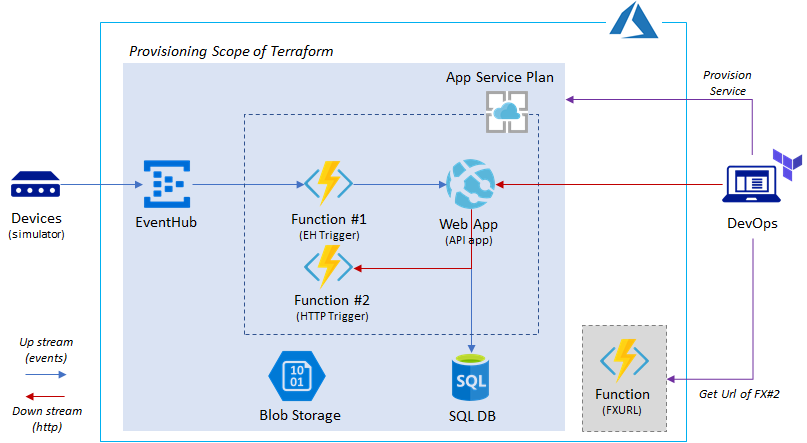

# Terraform for Azure PaaS

> Tested for terraform 0.12.18

One of challenges for provisioning PaaS services is deploying applications since `terraform` does not provide native way of deploying apps (e.g, Web App, Function App deployment). This sample terraform shows how to deploy and configure webapps or function apps using `terraform`.

This terraform sample create a following Azure PaaS services.

The sample does following:

1. Provision PaaS services
    - Event Hub
    - MS SQL
    - Blob Storage (for Function App)
    - App Service Plan
    - Function App #1 (Event Hub Trigger)
    - Function App #2 (Http Trigger)
        Installing Function using _ARM template deployment_
    - Web App
2. Setup database using _sqlcmd_
3. Installing apps using _zip deployment_
    - Function App #1
    - Web App

Please refer additional [documentation](Doc.md) for how to run and test this sample. 

